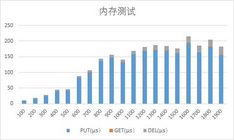

# LevelDB

[TOC]

## 设计部分

### 项目概况

#### 项目名称

*LevelDB* 键值存储系统

#### 项目介绍

本项目基于*LevelDB* 开发一个简化的键值存储系统。

该键值存储系统支持以下基本操作：

- **PUT(K, V)**设置键$K$ 的值为$V$。
- **GET(K)**读取键$K$ 的值。
- **DELETE(K)**删除键$K$ 及其值。

其中$K$ 是64 位无符号整数，$V$ 为字符串。

### 代码结构

*LevelDB* 键值存储系统分为**内存存储**和**硬盘存储**两部分，采用不同的存储方式。

#### 内存储存

##### 内存数据

承载类：***skipList***

利用内存中的***skipList***对象***memtable***实现数据在内存中的储存。

##### 硬盘目录

承载类：***Index***

利用内存中的***Index***对象***Dindex***记录所有硬盘目录中的***SSTable***的索引信息。

 #### 硬盘储存

文件对象：***SSTable***

***SSTable***数据结构如下：

|   **数据区（Key,Value)**   | **索引区（Key,Offest)** | **信息区（IndexOffset，Size，Timestamp）** |
| :------------------------: | :---------------------: | :----------------------------------------: |
| **(uint64_t,std::string)** |   **(uint64_t,int)**    |            **(int,int,time_t)**            |

文件目录结构如下：

```
--data
  --Level0
    --SSTable0
    --SSTable1
  --Level1
    --SSTable0
    --SSTable1
    --SSTable2
    --SStable3
  ...
  --Leveln
    --SSTable0
    ...
    --SSTable(2^{n+1}-1)
```

辅助类：***Buffer***

利用内存中的***Buffer***对象***Dbuffer***读取文件信息，合并且输入至硬盘。

### 功能实现理解

#### 代码功能

***KVStore***层面的代码如下，详细信息在注释中已标出

##### PUT(K,V)

```C++
/**
 * Insert/Update the key-value pair.
 * No return values for simplicity.
 */
void KVStore::put(uint64_t key, const std::string &s){
	//直接向memtable中插入
	memtable->insert(key, s);
	//数据大小
	int dataSIZE = memtable->getSIZE();
	//index大小
	int indexSIZE = memtable->getsize() * (sizeof(uint64_t) + sizeof(int));
	//剩余信息大小
	int infoSIZE = 2 * sizeof(int) + sizeof(time_t);
	int SIZE = dataSIZE + indexSIZE + infoSIZE;
	//若超出2M
	if (SIZE >= 2 * 1024 * 1024){
		writeToDisk();	  //写入level0
		checkCompactor(); //检查合并
	}
}
```

##### GET(K)

```C++
/**
 * Returns the (string) value of the given key.
 * An empty string indicates not found.
 */
std::string KVStore::get(uint64_t key)
{
	std::string tmp = "";
	//先到memtable中找
	tmp = memtable->getValue(key);
	//若memtable中删除了,直接返回not found
	if (tmp == "delete"){
		return "";
	}
	//若在memtable中找到了，直接返回memtable中的值
	else if (tmp != ""){
		return tmp;
	}
	//memtable中找不到的情况
	else{
		//先到index中找
		int level = 0, num = 0;
		int os = Dindex->searchKey(level, num, key);
		//找到了，直接去对应SSTable中找
		if (os != -1){
			std::string filePath = genFilePath(level, num);
			tmp = readValueFromFile(os, filePath); //内存读值
			//如果是delete
			if (tmp == "delete"){
				tmp = "";
			}
			return tmp;
		}
		//没找到，去SSTable中遍历寻找
		else{
			tmp = findInSSTable(key);
			if (tmp == "delete"){
				tmp = "";
			}
			return tmp;
		}
	}
	return tmp;
}
```

##### DELETE(K)

```C++
/**
 * Delete the given key-value pair if it exists.
 * Returns false iff the key is not found.
 */
bool KVStore::del(uint64_t key)
{
	//先到memtable里面找
	std::string tmp = memtable->getValue(key);
	//如果是delete记录，返回false
	if (tmp == "delete"){
		return false;
	}
	else if (tmp != ""){
		return memtable->remove(key);
	}
	//若找不到，到index中找
	else{
		//到index中找
		int level, num;
		int os = Dindex->searchKey(level, num, key);
		//找到记录
		if (os != -1){
			std::string folderPath = ".\\" + root + "\\level" + to_string(level);
			std::string filePath = folderPath + "\\SSTable" + to_string(num);
			//取出看看
			tmp = readValueFromFile(os, filePath);
			//已经delete
			if (tmp == "delete"){
				return false;
			}
			//有记录且还没delete
			else if (tmp != ""){
				memtable->insert(key, "delete");
				return true;
			}
			//没有记录
			else{
				return false;
			}
		}
		//index中找不到
		else
		{
			//到SSTable中找
			std::string tmp = findInSSTable(key);
			//找不到或者已经被删除
			if (tmp == "delete" || tmp == ""){
				return false;
			}
			//找到了
			else{
				memtable->insert(key, "delete");
				return true;
			}
		}
	}
}
```

***compactor***部分也是本个project的核心。

逻辑简述如下：

```pseudocodes
对本层文件进行处理，将本层超出容量部分文件读取到Dbuffer中，删除原有文件和Dindex中的记录
进入下一层，分情况讨论：
   1.若下一层没有文件：
       创建目录，将Dbuffer中所有数据归并排序吼输入至新建目录中
   2.若下一层存在文件：
       确认上一层数据的key范围，扫描本层文件，分类讨论：
       1.上层所有文件的key比本层第一个文件的minkey小：
            从SSTable0处开始输入数据
       2.上层所有文件的key比本层最后一个文件的maxkey小：
            从最后一个文件后开始输入数据
       3.存在交集
            读取所有交集文件，然后从第一个交集处文件开始输入
确认下一层层文件是否超出容量，若超出，合并下一层。
```

### 独特实现

1. 仔细观察可以发现，在level0层，文件号越高，数据记录越新；而在level0层之外，虽然每层文件可能会有交集，但上层文件记录总是比下层文件记录新。所以在compact遇到相同key的时候，可以根据文件的层号和文件号来确定选择哪一条记录，所以不需要每一个键值对赋予一个时间戳，可以减少很多数据量。但为了保险起见，我保留了整个文件的时间戳。

2. 在SSTable中写入IndexOffset来快速确定Index位置。

3. 实现了index和buffer类，职能更加独立。


## 测试部分

### 测试环境

机型：Legion Y7000-1060

Windows版本： Windows 10 家庭中文版

处理器：Intel(R) Core(TM) i7-8750 CPU @2.20GHZ 2.21GHZ

机带RAM： 8 GB

磁盘：WDC PC SN720 SDAPNTW-512G-1101

系统类型：64位操作系统，基于x64的处理器

### 正确性测试

利用助教提供的***correctness***，**Simple Test**数据量$512$，**Large Test**数据量$1024*64$

#### 测试结果


测试总时长：约7min

### 持久性测试

利用助教提供的***persistence***，数据量$1024*32$

#### 测试结果


准备时长：约3min

测试时长：约3s

### 时延测试

#### 测试方法

1.插入一定数量的数据**(i, std::string(i + 1, 's'))**，计算平均插入时间。

2.读取插入数据，计算平均读取时间。

3.删除所有数据，计算平均删除时间。

#### 测试结果与分析

##### 内存测试

插入数据量不大，只在内存中进行插入。

  

这部分主要是对skiplist的性能分析，因为算法课已经分析过了，这里就不再分析。

##### 硬盘测试

在写入硬盘的代码处打上断点，发现在插入第2028个数据时会将文件第一次写入硬盘，以i=2028进行测试并与i=1000时的数据进行对比

| 数据量 | PUT(μs） | GET(μs） | DEL(μs） |
| ------ | -------- | -------- | -------- |
| 1000   | 132.031  | 0.82579  | 8.53452  |
| 2028   | 138.772  | 146.985  | 267.92   |

**PUT**：因为*PUT*操作同为往*skiplist*中插入记录，而区别在于i*=2028*次的操作会进行一次写入磁盘操作，但平均下来二者差距不大。

**GET**：*GET*操作在跳表阶段只需要在跳表内部查找，时间消耗比较小；但在磁盘中查找，需要先读取***Dindex***中的数据位置，再到磁盘中读取，时间消耗增加了很多。

**DEL**：内存阶段，*DEL*操作只需要在内存中寻找并删除对应键值对；但在磁盘阶段，*DEL*操作需要到磁盘中寻找值来确定是否需要插入删除记录；在本次测试中，因为所有键值对都能被找到，所有*DEL*消耗约为*GET*与*PUT*之和。

### 吞吐量测试

#### 测试方法

不断插入数据的情况下，每秒钟处理的PUT 请求个数（即吞吐量）随时间变化的折线图。

插入数据为**(i,string(1000,'s'))**

#### 测试结果与分析

结果如图：


这个图非常有趣，大概可以看出来，数据呈现周期性变化，符合实际情况。

可以分为三个阶段：

1. 向memtable中插入阶段，这个阶段的插入效率是最高的，在图中表现为峰值。
2. 向level0写入，但是不需要compact阶段，这个阶段效率次高，这个阶段跟在每次峰值后面。
3. compact阶段，这个阶段会在三次向level0写入阶段后面，符合程序设计，且随着数据量的增加，每次compact需要的时间长度会越来越长。

